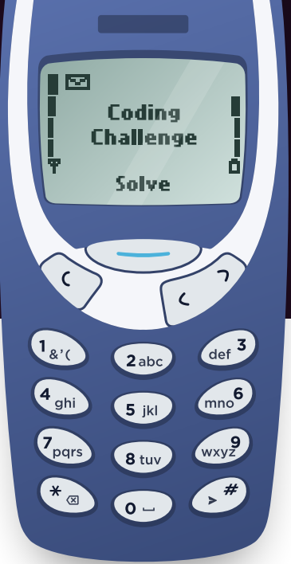
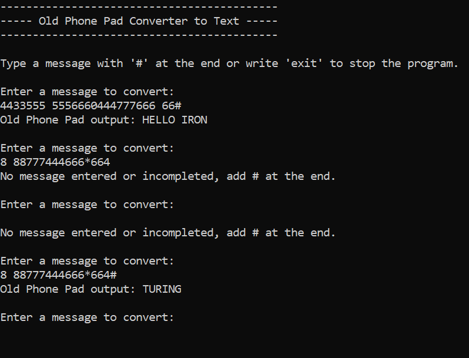

# 📱 Old Phone Pad Converter

## 📖 Overview

C# Coding Challenge

This project simulates typing text on an **old mobile phone keypad**.  

Here is an old phone keypad with alphabetical letters, a backspace key, and a send button. Each button has a number to identify it and pressing a button multiple times will cycle through the letters on it allowing each button to represent more than one letter.

For example, pressing 2 once will return ‘A’ but pressing twice in
succession will return ‘B’.
You must pause for a second in order to type two characters from the same button
after each other: “222 2 22” -> “CAB”.

The following image ilustrates the keypad with the characters:



We can assume that a send “#” will always be included at the end of every input.
Here there are some examples:

OldPhonePad(“33#”) => output: E

OldPhonePad(“227*#”) => output: B

OldPhonePad(“4433555 555666#”) => output: HELLO

OldPhonePad(“8 88777444666*664#”) => output: TURING

## ▶️ Running the Program
1.	Clone the repository.
2.	Open the solution in Visual Studio.
3.	Set the OldPhonePadConverter project as the startup project.
4.	Run with Ctrl+F5.
5.	Follow the prompts in the console.

## 🧪 Running Tests
This solution includes an **XUnit test project** (`OldPhonePadConverter.Tests`).

To run tests:
- In Visual Studio:  
  - Go to top menu and `Test > Run All Tests`  
- Or from the command line:  
  ```bash
  dotnet test

## ✅ Test cases
- Simple word: "33#" → "E"

- Backspace handling: "227*#" → "B"

- Multi-characters: "4433555 555666#" → "HELLO"

- Longer example with backspace: "8 88777444666*664#" → "TURING"

- Incomplete input without '#': "227*" → ""

- Another full word: "444777666 66#" → "IRON"

- Key 1 mapping: "1#" → "&"

- Cycles back: "1111#" → "&"

- Backspace at the begining: "*#" → ""

- Multiple backspaces in a row: "227**#" → ""

- More multiple backspaces in a row than characters: "22**#" → "" 

- Spaces in the word: "44033055505550666#" → "H E L L O"

- Only space message: "0#" → " "

- Valid and invalid inputs in a row: "2A3#" → "AD"

- Empty message: "" → ""

- Multiple '#': "4433555 555666096667775553###" → "HELLO WORLD"


## 🖥️ Example Run
Screenshot of the program running in the console:


## 🛠️ Design Notes
- Separationg of Concerns
	- `Program.cs`: execute the program and interact with the user with input and output using OldPhonePadConverter class to get the text converted from numbers.
	- `OldPhonePadConverter.cs`: class with the logic to convert the numbers pressed from the keypad to text.
	- `Constants.cs`: class with the keypad mapping dictionary and other constant variables uses the program.
- Refactoring
	- Initially, all the logic in one class. After that, refactoring `OldPhonePadConverter.cs` extracting helper methods as RemoveBackspace, SameButtonPressed and AddCharactersToResult. Also refactoring `Program.cs` for improve understanding and organization.
- Testing
	- Test cases cover normal words, backspaces, double backspaces, incomplete input and spaces.

## 🚀 Future Improvements
- Support lowercase or numeric mode.
- UI version.